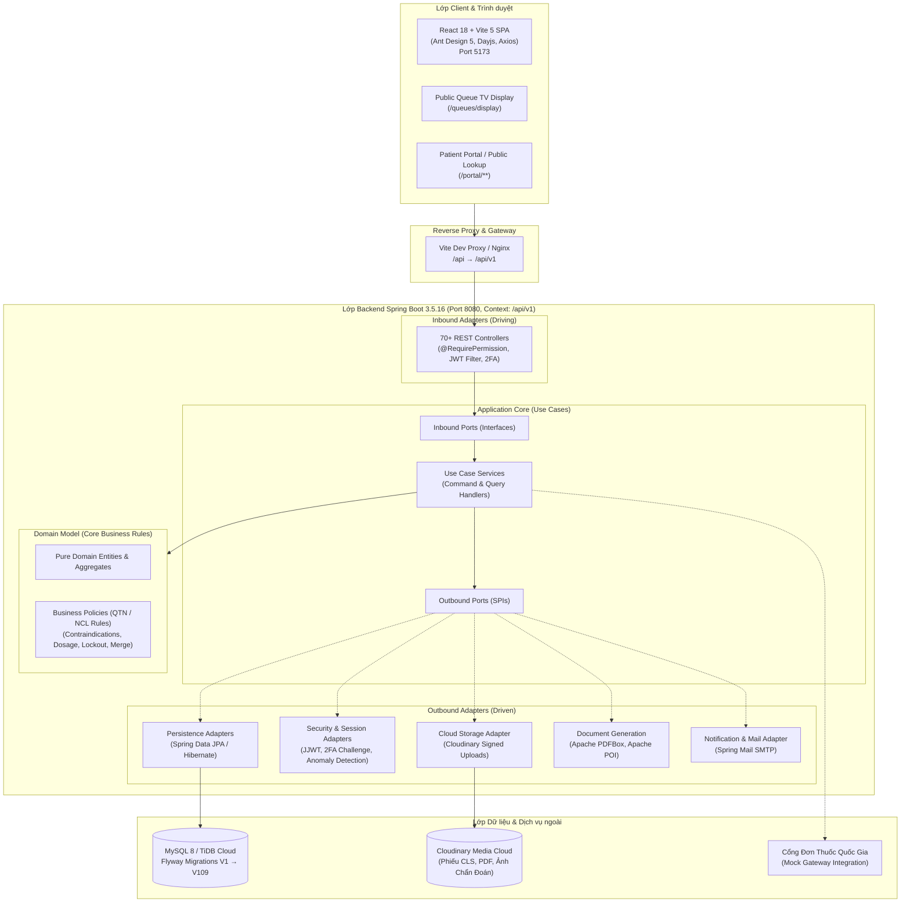
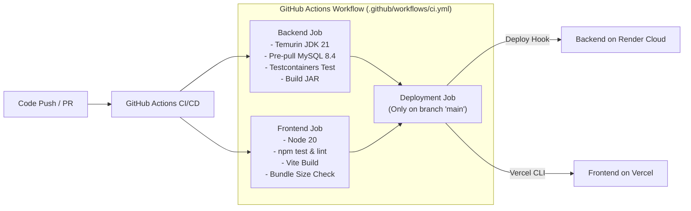

# 🏥 Bệnh số án (Digital Medical Record System)

> **Hệ thống chuyển đổi số cơ sở khám chữa bệnh toàn diện** — Quản lý hồ sơ bệnh án điện tử, khám bệnh, cận lâm sàng, dược phẩm, viện phí và cổng thông tin bệnh nhân theo tiêu chuẩn Hexagonal Architecture & Domain-Driven Design (DDD).

[-orange.svg)](https://adoptium.net/)
[](https://spring.io/projects/spring-boot)
[](https://react.dev/)
[](https://vitejs.dev/)
[](https://ant.design/)
[](https://www.mysql.com/)
[](https://flywaydb.org/)
[](https://www.docker.com/)
[](https://github.com/features/actions)
[](https://www.jenkins.io/)
[](LICENSE)

---

## 📋 Mục lục

1. [Tổng quan dự án](#-tổng-quan-dự-án)
2. [Kiến trúc hệ thống](#-kiến-trúc-hệ-thống)
3. [Công nghệ sử dụng](#-công-nghệ-sử-dụng)
4. [Các phân hệ và tính năng chính](#-các-phân-hệ-và-tính-năng-chính)
5. [Cấu trúc mã nguồn](#-cấu-trúc-mã-nguồn)
6. [Hướng dẫn cài đặt & Khởi chạy](#-hướng-dẫn-cài-đặt--khởi-chạy)
   - [Yêu cầu tiên quyết](#yêu-cầu-tiên-quyết)
   - [Cấu hình Cơ sở dữ liệu (MySQL 8 + Flyway)](#cấu-hình-cơ-sở-dữ-liệu-mysql-8--flyway)
   - [Khởi chạy Backend (Spring Boot)](#khởi-chạy-backend-spring-boot)
   - [Khởi chạy Frontend (React + Vite)](#khởi-chạy-frontend-react--vite)
   - [Triển khai với Docker](#triển-khai-với-docker)
7. [Tài khoản Demo & Phân quyền hệ thống](#-tài-khoản-demo--phân-quyền-hệ-thống)
8. [Tài liệu API & Swagger UI](#-tài-liệu-api--swagger-ui)
9. [Hệ thống CI/CD & Tự động hóa](#-hệ-thống-cicd--tự-động-hóa)
10. [An toàn thông tin & Tuân thủ pháp lý](#-an-toàn-thông-tin--tuân-thủ-pháp-lý)
11. [Đội ngũ phát triển & Giấy phép](#-đội-ngũ-phát-triển--giấy-phép)

---

## 📖 Tổng quan dự án

**Bệnh số án** là nền tảng quản trị và số hóa toàn diện quy trình y tế dành cho các cơ sở khám chữa bệnh, phòng khám đa khoa và bệnh viện số. Hệ thống được thiết kế theo các tiêu chuẩn khắt khe về an toàn dữ liệu y tế, chuẩn mã hóa bệnh tật quốc tế **ICD-10**, liên thông đơn thuốc quốc gia và quy định về bảo vệ dữ liệu cá nhân (**Nghị định 13/2023/NĐ-CP**).

### 🎯 Mục tiêu cốt lõi
- **Không giấy tờ (Paperless Hospital):** Số hóa 100% hồ sơ bệnh án, phiếu chỉ định cận lâm sàng, đơn thuốc điện tử và hóa đơn viện phí.
- **Tính toàn vẹn & Pháp lý y tế:** Bệnh án điện tử hỗ trợ ký số (Digital Signature), đóng băng hồ sơ (Lock/Archive), lịch sử chỉnh sửa phiên bản (Version History) và vết kiểm toán truy cập (Audit Logs).
- **An toàn người bệnh:** Tự động kiểm tra tương tác thuốc, quy tắc chống chỉ định, cảnh báo dị ứng, tiền sử bệnh mạn tính và cảnh báo vượt ngưỡng liều tối đa hàng ngày.
- **Tối ưu trải nghiệm:** Phân luồng hàng đợi khám bệnh thông minh (ưu tiên cấp cứu/trẻ em/người cao tuổi), màn hình hiển thị công cộng thời gian thực và Cổng thông tin phục vụ bệnh nhân tra cứu kết quả trực tuyến.

---

## 🏗️ Kiến trúc hệ thống

Dự án áp dụng chặt chẽ **Kiến trúc Lục giác (Hexagonal Architecture / Ports & Adapters)** kết hợp **Thiết kế hướng miền (Domain-Driven Design - DDD)** và nguyên lý phân tách trách nhiệm đọc/ghi (CQRS).



### 🧩 Phân tầng kiến trúc Backend
- **`domain`**: Chứa pure entities, value objects, domain events, domain exceptions và business rules độc lập với frameworks.
- **`port/inbound` & `port/outbound`**: Định nghĩa giao diện (ports) cho các ca sử dụng (Inbound Ports) và các giao tiếp hạ tầng như kho dữ liệu, bảo mật, thời gian, gửi mail (Outbound Ports).
- **`application/ucservice`**: Triển khai các use case services, thực thi quy trình điều phối giữa domain logic và các cổng giao tiếp.
- **`adapter/inbound/rest`**: Tiếp nhận HTTP request, ánh xạ DTO qua Mapper, kiểm tra phân quyền động và điều hướng tới Inbound Ports.
- **`persistence`**: Triển khai Outbound Ports, quản lý JPA Entities, Spring Data Repositories và Entity-Domain Mappers.
- **`infrastructure`**: Cung cấp hạ tầng kỹ thuật (Spring Security, JWT Token Filter, 2FA Challenge Store, Cloudinary Storage, Scheduled Tasks, Apache POI/PDFBox).

---

## 🛠️ Công nghệ sử dụng

### Backend Stack
| Phân loại | Công nghệ / Thư viện | Phiên bản | Mô tả chức năng |
|-----------|----------------------|-----------|-----------------|
| **Nền tảng** | Java OpenJDK (Temurin) | 21 | Phiên bản LTS với Virtual Threads, Record Pattern |
| **Framework** | Spring Boot | 3.5.16 | Core framework (REST API, Inversion of Control) |
| **Bảo mật** | Spring Security & JJWT | 6.x / 0.12.6 | Xác thực Stateless JWT (15m), 2FA, Dynamic RBAC |
| **ORM & Database** | Spring Data JPA / Hibernate | 6.x | Tương tác cơ sở dữ liệu quan hệ, DDL-auto validate |
| **Migration** | Flyway (Core + MySQL) | Tích hợp | Tự động quản lý tiến trình schema từ **V1 → V109** |
| **Cơ sở dữ liệu** | MySQL Server / TiDB Cloud | 8.0 / 8.4 | Lưu trữ dữ liệu chính thức, hỗ trợ UUID binary(16) |
| **Object Mapping** | MapStruct | 1.6.2 | Biên dịch mapping Entity ↔ Domain DTO không reflection |
| **Tài liệu API** | SpringDoc OpenAPI | 2.8.6 | Sinh tài liệu OpenAPI 3.0 & giao diện Swagger UI |
| **Lưu trữ đám mây** | Cloudinary Java HTTP5 | 2.4.0 | Lưu trữ có ký danh (Signed URL) phiếu kết quả CLS & ảnh |
| **Xử lý tài liệu** | Apache PDFBox & Apache POI | 3.0.5 / 5.4.0 | In tóm tắt bệnh án (PDF) & Xuất báo cáo tài chính/dược (Excel) |
| **Kiểm thử** | Testcontainers & JUnit 5 | 1.20.4 / 5.x | Kiểm thử tích hợp tự động với container MySQL 8.4 thực tế |

### Frontend Stack
| Phân loại | Công nghệ / Thư viện | Phiên bản | Mô tả chức năng |
|-----------|----------------------|-----------|-----------------|
| **UI Library** | React | 18.3.1 | Giao diện Single Page Application (SPA) hiện đại |
| **Build Tool** | Vite | 5.4.10 | Máy chủ phát triển HMR cực nhanh, tối ưu hóa bundle |
| **Component Kit** | Ant Design & Icons | 5.21.6 / 5.5.1 | Hệ thống design system y tế chuyên nghiệp |
| **Định tuyến** | React Router DOM | 6.28.0 | Định tuyến trang, phân quyền bảo vệ tuyến route |
| **HTTP Client** | Axios | 1.7.7 | Xử lý request, tự động đính kèm Bearer Token & Interceptors |
| **Form Handling** | React Hook Form | 7.53.2 | Quản lý form nhập liệu hiệu năng cao |
| **Thời gian & Data** | Dayjs & SheetJS (xlsx) | 1.11.13 / 0.18.5 | Xử lý ngày tháng múi giờ `Asia/Ho_Chi_Minh`, xuất Excel client |
| **Thông báo** | React Hot Toast | 2.4.1 | Hệ thống pop-up thông báo trạng thái thao tác |
| **Chất lượng mã** | Node Test Runner & ESLint | Node 20 / 9.13.0 | Kiểm thử tự động component và kiểm tra chuẩn cú pháp |

---

## ✨ Các phân hệ và tính năng chính

Hệ thống bao gồm hơn **70 REST Controllers** và hơn **40 giao diện nghiệp vụ**, được tổ chức thành 12 phân hệ toàn diện:

### 1. 🔐 Xác thực, Phân quyền & Quản trị phiên (Security & Auth)
- **JWT Authentication:** Cấp phát Access Token (thời hạn 15 phút - 900.000ms) kết hợp quản lý phiên làm việc (`SessionManagementController`).
- **Xác thực 2 yếu tố (2FA):** Cơ chế challenge OTP/SMS bảo vệ các tác vụ quan trọng (`TwoFactorAuthenticationController`).
- **Phân quyền động (Dynamic RBAC):** Kiểm soát truy cập ở mức chức năng qua annotations `@RequirePermission` (`ROLE_READ`, `PATIENT_MERGE`, `PRESCRIPTION_UPDATE`, ...).
- **Phát hiện bất thường & Khóa tài khoản:** Cảnh báo khi tần suất đọc hồ sơ vượt ngưỡng 20 lượt/giờ ngoài giờ hành chính; tự động khóa tài khoản sau nhiều lần nhập sai mật khẩu.
- **Giám sát hoạt động (Admin Audit):** Bảng ghi nhật ký thao tác quản trị (`AdminOperationLogController`).

### 2. 👥 Quản lý Tiếp đón & Bệnh nhân (Patient Management)
- **Hồ sơ bệnh nhân toàn diện:** Quản lý thông tin định danh, số BHYT, nhóm máu, số CCCD/CMND.
- **Hồ sơ y tế mở rộng:** Quản lý tiền sử dị ứng thuốc/thực phẩm (`PatientAllergy`), tiền sử bệnh mạn tính (`PatientChronicDisease`), tiền sử gia đình (`PatientFamilyHistory`) và người giám hộ (`PatientGuardian`).
- **Gộp hồ sơ trùng lặp (Patient Merge):** Thuật toán tìm kiếm hồ sơ nghi trùng theo họ tên, ngày sinh, SĐT; chuyển toàn bộ lượt khám, chỉ định, công nợ sang hồ sơ đích an toàn.
- **Dấu hiệu sinh tồn (Vital Signs):** Ghi nhận huyết áp, mạch, nhiệt độ, SpO2, nhịp thở theo từng lượt khám.
- **Nhập dữ liệu hàng loạt (Patient Batch Import):** Hỗ trợ import danh sách bệnh nhân từ Excel/CSV với xác thực dữ liệu chặt chẽ.

### 3. ⏱️ Hàng đợi khám & Điều phối phòng khám (Medical Queue)
- **Cấp số thứ tự thông minh:** Phân luồng ưu tiên (`NORMAL`, `PRIORITY` cho cấp cứu, người khuyết tật, trẻ nhỏ, người già).
- **Điều phối phòng khám:** Phân công bác sĩ - phòng khám (`DoctorRoomAssignmentController`), gọi số khám, hoãn lượt (`defer`), gọi lại lượt nhỡ.
- **Màn hình hiển thị công cộng (Public Queue Display):** Endpoint công khai `GET /queues/display` phục vụ hiển thị số thứ tự thời gian thực trên TV phòng chờ.

### 4. 📋 Bệnh án điện tử & Khám chữa bệnh (Digital Medical Records)
- **Hồ sơ bệnh án điện tử:** Ghi nhận lý do khám, quá trình bệnh lý, khám thực thể, hướng điều trị và chế độ chăm sóc.
- **Ký số bệnh án (Digital Signature):** Ký xác nhận hoàn tất bệnh án; theo dõi và cảnh báo các bệnh án quá hạn ký (`OverdueMedicalRecordSigningPage`).
- **Lịch sử phiên bản & Sao chép:** Theo dõi lịch sử chỉnh sửa bệnh án (`version-history`); sao chép dữ liệu đợt khám trước nhanh chóng.
- **Mẫu bệnh án (Clinical Templates):** Áp dụng mẫu bệnh án định sẵn theo chuyên khoa để chuẩn hóa chẩn đoán.
- **Nhật ký truy cập (Access Logs):** Mọi lượt đọc/ghi hồ sơ bệnh án đều tự động lưu vết kiểm toán (Audit Trail) để bảo mật thông tin y tế.
- **In phiếu tóm tắt điều trị (Visit Summary Print):** Xuất phiếu tóm tắt quá trình khám bệnh định dạng PDF chuẩn (sử dụng Apache PDFBox).

### 5. 🩺 Chẩn đoán & Danh mục mã bệnh ICD-10
- **Danh mục ICD-10:** Tra cứu mã bệnh thông minh, hỗ trợ tìm kiếm không dấu, từ khóa viết tắt (`DiagnosisCatalogController`).
- **Quy tắc chẩn đoán (QTN-22):** Chẩn đoán chính bắt buộc gắn mã ICD-10 đang hiệu lực; chẩn đoán phụ hỗ trợ nhiều mã kèm ghi chú tự do.
- **Quyền hạn ghi nhận (QTN-11):** Chỉ tài khoản có vai trò `DOCTOR` phụ trách ca khám mới được phép cập nhật chẩn đoán.

### 6. 🧪 Cận lâm sàng & Kết quả xét nghiệm / CĐHA (Clinical Orders & Results)
- **Chỉ định dịch vụ (Clinical Orders):** Bác sĩ chỉ định các xét nghiệm máu, nước tiểu, X-Quang, Siêu âm, CT/MRI.
- **Nhập kết quả & Khoảng tham chiếu (Reference Ranges):** Tự động đối chiếu chỉ số kết quả với khoảng tham chiếu chuẩn (nam, nữ, độ tuổi) để gắn cờ bất thường (`LOW`, `HIGH`, `CRITICAL`).
- **Lưu trữ hình ảnh/PDF (Cloudinary):** Tải lên và quản lý ảnh chụp chẩn đoán hình ảnh, phiếu kết quả có chữ ký qua Cloudinary với đường dẫn an toàn có thời hạn.

### 7. 💊 Đơn thuốc & Quản trị Dược lâm sàng (Prescription & Pharmacy)
- **Kê đơn thuốc điện tử:** Hỗ trợ kê đơn từ danh mục thuốc khả dụng, hỗ trợ tạo và áp dụng mẫu đơn thuốc (`PrescriptionTemplate`).
- **An toàn dược lâm sàng:**
  - Kiểm tra tương tác thuốc và quy tắc chống chỉ định (`ContraindicationRuleController`).
  - Kiểm tra liều tối đa hàng ngày (`Max Daily Dose`) ngăn ngừa quá liều.
  - Cảnh báo an toàn đối với phụ nữ mang thai hoặc đang cho con bú.
- **Cấp phát thuốc tại quầy dược:** Hỗ trợ cấp phát toàn bộ hoặc cấp phát một phần (`partially dispensed`), quản lý trừ tồn kho theo lô (Batch/Lot) và hạn dùng.
- **Sổ theo dõi thuốc kiểm soát đặc biệt:** Quản lý thuốc gây nghiện, hướng thần, tiền chất theo quy định Bộ Y Tế.
- **Liên thông đơn thuốc quốc gia:** Tích hợp module gửi và đồng bộ đơn thuốc lên Cổng đơn thuốc điện tử quốc gia (hỗ trợ Mock Gateway để thử nghiệm).

### 8. 📦 Quản trị Kho Dược & Vật tư y tế (Inventory Management)
- **Quản lý nhập kho (Inventory Receipts):** Nhập thuốc theo số lô, nhà cung cấp, đơn giá, hạn sử dụng.
- **Cảnh báo tồn kho:** Tự động cảnh báo thuốc sắp hết hạn (`expiry-alerts`) hoặc tồn kho dưới ngưỡng an toàn (`low-stock`).
- **Kiểm kê & Điều chỉnh:** Điều chỉnh tồn kho, lập biên bản hủy lô thuốc hết hạn hoặc hư hao.
- **Kế hoạch mua sắm (Medication Procurement):** Lập đề xuất và theo dõi quy trình duyệt mua sắm dược phẩm.

### 9. 💳 Viện phí, Hóa đơn & Thu ngân (Billing & Cashier)
- **Hóa đơn viện phí tự động:** Tổng hợp tiền khám, phí dịch vụ cận lâm sàng và tiền thuốc theo từng lượt khám.
- **Đa phương thức thanh toán:** Hỗ trợ thanh toán linh hoạt kết hợp tiền mặt, chuyển khoản ngân hàng (QR Code) và thẻ.
- **Giao ca & Chốt ca thu ngân (Cashier Shifts):** Mở ca, bàn giao tiền đầu ca, kết ca, đối soát số dư tiền mặt/chuyển khoản và in biên bản chốt ca.
- **Xét duyệt miễn giảm (Discount Requests):** Quy trình đề xuất và phê duyệt chiết khấu, miễn giảm viện phí có thẩm quyền.

### 10. 📅 Đặt lịch khám & Tái khám (Appointments & Scheduling)
- **Quản lý lịch làm việc bác sĩ:** Thiết lập ca trực, lịch khám hàng tuần và đăng ký lịch nghỉ phép.
- **Đặt lịch hẹn:** Đặt lịch theo bác sĩ, chuyên khoa; đặt lịch khám định kỳ theo chuỗi liệu trình (`AppointmentSeries`).
- **Danh sách chờ (Waitlist):** Tự động xếp lịch khi có bệnh nhân hủy hẹn.
- **Nhắc lịch tự động:** Scheduler tự động quét và gửi thông báo nhắc lịch hẹn trước 24 giờ qua Email/Hệ thống.

### 11. 📱 Cổng thông tin Bệnh nhân (Patient Portal & Public Lookup)
- **Tra cứu công cộng (Public Lookup):** Bệnh nhân tra cứu lịch khám và kết quả xét nghiệm qua mã đặt hẹn / mã hồ sơ mà không cần đăng nhập.
- **Cổng cá nhân bệnh nhân:** Dành cho tài khoản `ROLE_PATIENT` để theo dõi hồ sơ điều trị cá nhân, lịch sử đơn thuốc, hóa đơn, nhận thông báo và gửi khảo sát đánh giá độ hài lòng.

### 12. 📊 Báo cáo quản trị & Tuân thủ dữ liệu (Reporting & Compliance)
- **Báo cáo tài chính & Vận hành:** Thống kê doanh thu theo phòng khám/bác sĩ, cơ cấu dịch vụ, top thuốc sử dụng, mô hình bệnh tật (ICD-10) xuất file Excel (Apache POI).
- **Chế độ che mờ dữ liệu (Anonymization Mode):** Ẩn các thông tin định danh nhạy cảm (Họ tên, SĐT, CCCD) khi xem và trích xuất báo cáo thống kê nghiên cứu.
- **Bảo vệ dữ liệu cá nhân (Nghị định 13/2023/NĐ-CP):** Xử lý các yêu cầu cung cấp, chỉnh sửa, rút lại đồng thuận dữ liệu cá nhân (`PersonalDataRequestController`) kèm hệ thống cảnh báo hạn xử lý.
- **Sao lưu & Phục hồi (Backup & Restore):** Quản lý cấu hình sao lưu cơ sở dữ liệu định kỳ và xác thực tính toàn vẹn của tệp sao lưu.

---

## 📁 Cấu trúc mã nguồn

```text
Benh-so-an/
├── backend/                                  # Ứng dụng Backend Spring Boot 3.5.16
│   ├── pom.xml                               # Quản lý dependencies (Java 21, Spring Boot, MapStruct, etc.)
│   ├── Dockerfile                            # Multi-stage Docker build (Temurin 21)
│   └── src/
│       ├── main/
│       │   ├── java/com/benhsoan/
│       │   │   ├── BenhSoAnApplication.java  # Main application entry point
│       │   │   ├── config/                   # Cấu hình Security, CORS, Swagger, Properties
│       │   │   ├── domain/                   # Thuần Domain Entities, Aggregates, Business Rules
│       │   │   ├── port/
│       │   │   │   ├── inbound/              # UseCase Port Interfaces
│       │   │   │   ├── outbound/             # SPI Outbound Port Interfaces
│       │   │   │   └── dto/                  # Commands, Queries, Result DTOs
│       │   │   ├── application/ucservice/    # Triển khai UseCase Services (Business Logic)
│       │   │   ├── adapter/inbound/rest/
│       │   │   │   ├── controller/           # 70 REST Controllers
│       │   │   │   ├── request/              # DTO tiếp nhận từ client
│       │   │   │   ├── response/             # DTO phản hồi client
│       │   │   │   └── mapper/               # MapStruct & Rest Mappers
│       │   │   ├── persistence/
│       │   │   │   ├── entity/               # JPA Entities
│       │   │   │   ├── jpaRepository/        # Spring Data JPA Interfaces
│       │   │   │   ├── adapterRepository/    # Outbound Repository Adapter implementations
│       │   │   │   └── mapper/               # Entity ↔ Domain Mappers
│       │   │   ├── infrastructure/           # Hạ tầng kỹ thuật (JWT, 2FA, Cloudinary, Schedulers, POI/PDF)
│       │   │   ├── exception/                # GlobalExceptionHandler & DomainExceptionMapper
│       │   │   └── common/                   # Tiện ích dùng chung
│       │   └── resources/
│       │       ├── application.properties    # Cấu hình gốc (Server, JWT 15m, Flyway, Cloudinary)
│       │       ├── application-local.properties  # Profile chạy Local (MySQL 8 localhost)
│       │       ├── application-dev.properties    # Profile Dev Cloud (TiDB Cloud)
│       │       ├── application-prod.properties   # Profile Production (Render / Cloud DB)
│       │       └── db/migration/             # 109 file Flyway Migration (V1 → V109)
│       └── test/java/com/benhsoan/           # Kiểm thử tự động (Unit, MockMvc, Testcontainers)
│
├── frontend/                                 # Ứng dụng Frontend React 18 + Vite 5
│   ├── package.json                          # Dependencies & NPM Scripts (Node 20, Antd 5)
│   ├── vite.config.js                        # Cấu hình Vite, Server Port 5173 & Proxy /api
│   ├── vercel.json                           # Cấu hình SPA routing deploy trên Vercel
│   ├── scripts/
│   │   └── check-bundle-size.mjs             # Script CI kiểm tra dung lượng bundle size
│   └── src/
│       ├── api/                              # Axios Client & API service modules
│       ├── components/                       # UI components tái sử dụng (Layout, Clinical, etc.)
│       ├── context/                          # AuthContext, Global state
│       ├── pages/                            # Hơn 40 trang chức năng và các bộ kiểm thử unit
│       ├── routes/                           # Cấu hình điều hướng AppRoutes & Route Guards
│       ├── App.jsx                           # Root component
│       └── main.jsx                          # Frontend entry point
│
├── docs/                                     # Tài liệu thiết kế, ma trận quyền & hợp đồng API
│   ├── api/                                  # 45 file API Contract Specs chi tiết
│   ├── permission-matrix.md                  # Bảng tra cứu mã quyền RBAC chi tiết
│   ├── project-overview.md                   # Tổng quan dự án
│   └── ...
│
├── .github/workflows/
│   └── ci.yml                                # Pipeline CI/CD GitHub Actions (Testcontainers, Build, Deploy)
├── Jenkinsfile                               # Pipeline CI/CD Jenkins đa tầng chạy trên Docker
└── README.md                                 # Tài liệu dự án chính thức
```

---

## 🚀 Hướng dẫn cài đặt & Khởi chạy

### Yêu cầu tiên quyết
- **Java Development Kit (JDK):** Phiên bản **21** (Khuyến nghị [Eclipse Temurin 21](https://adoptium.net/))
- **Apache Maven:** Phiên bản **3.9+** (hoặc sử dụng wrapper `./mvnw`)
- **Node.js & npm:** Node.js **20 LTS** & npm **10+**
- **Cơ sở dữ liệu:** **MySQL Server 8.0** hoặc **8.4 LTS**
- **Docker & Docker Compose (Tùy chọn):** Dành cho kiểm thử Testcontainers và đóng gói container

---

### Cấu hình Cơ sở dữ liệu (MySQL 8 + Flyway)

1. Khởi động MySQL Server trên máy của bạn (Port mặc định: `3306`).
2. Tạo database trắng (Flyway sẽ tự động sinh toàn bộ bảng và dữ liệu mẫu):
```sql
CREATE DATABASE IF NOT EXISTS digital_medical_record 
CHARACTER SET utf8mb4 
COLLATE utf8mb4_unicode_ci;
```

---

### Khởi chạy Backend (Spring Boot)

Mặc định ứng dụng kích hoạt profile `local` kết nối tới MySQL `localhost:3306`.

1. Di chuyển vào thư mục backend:
```bash
cd backend
```

2. Cài đặt biến môi trường mật khẩu database (nếu khác mặc định):
- **Trên Windows (cmd):**
  ```cmd
  set DB_URL=jdbc:mysql://localhost:3306/digital_medical_record?createDatabaseIfNotExist=true&useSSL=false&allowPublicKeyRetrieval=true&serverTimezone=Asia/Ho_Chi_Minh
  set DB_USERNAME=root
  set DB_PASSWORD=YourPassword@123
  ```
- **Trên Linux / macOS:**
  ```bash
  export DB_URL="jdbc:mysql://localhost:3306/digital_medical_record?createDatabaseIfNotExist=true&useSSL=false&allowPublicKeyRetrieval=true&serverTimezone=Asia/Ho_Chi_Minh"
  export DB_USERNAME="root"
  export DB_PASSWORD="YourPassword@123"
  ```

3. Chạy kiểm thử tự động (sử dụng H2 & Testcontainers):
```bash
mvn clean test
```

4. Khởi chạy ứng dụng:
```bash
mvn spring-boot:run
```
> Khi khởi động, **Flyway** sẽ tự động thực thi 109 migration scripts (`V1` đến `V109`), thiết lập đầy đủ bảng, dữ liệu mẫu phân quyền, danh mục bệnh tật, danh mục thuốc và tài khoản mặc định.
> 
> 🌐 Backend URL: `http://localhost:8080/api/v1`

---

### Khởi chạy Frontend (React + Vite)

1. Di chuyển vào thư mục frontend:
```bash
cd frontend
```

2. Cài đặt các gói phụ thuộc:
```bash
npm install
```

3. Chạy kiểm tra chất lượng mã (Lint & Test):
```bash
npm run lint
npm test
```

4. Khởi chạy máy chủ phát triển:
```bash
npm run dev
```

> 🌐 Giao diện Web: `http://localhost:5173`
> 
> *Ghi chú:* Vite được cấu hình proxy tự động chuyển tiếp tất cả request bắt đầu bằng `/api` sang `http://localhost:8080/api/v1`.

---

### Triển khai với Docker

Backend hỗ trợ đóng gói bằng Dockerfile đa tầng (Multi-stage build) bảo mật với non-root user `appuser`:

1. Build Docker Image cho backend:
```bash
cd backend
docker build -t benh-an-so-backend:latest .
```

2. Chạy container:
```bash
docker run -d \
  --name benh-an-so-backend \
  -p 8080:8080 \
  -e DB_URL="jdbc:mysql://host.docker.internal:3306/digital_medical_record?useSSL=false&allowPublicKeyRetrieval=true&serverTimezone=Asia/Ho_Chi_Minh" \
  -e DB_USERNAME="root" \
  -e DB_PASSWORD="YourPassword@123" \
  -e JWT_SECRET="PROD_SECRET_KEY_MUST_BE_AT_LEAST_32_BYTES_LONG_HERE" \
  benh-an-so-backend:latest
```

---

## 👥 Tài khoản Demo & Phân quyền hệ thống

Hệ thống đã nạp sẵn dữ liệu tài khoản chuẩn đại diện cho các vị trí nghiệp vụ tại cơ sở y tế:

| Tên đăng nhập | Mật khẩu mặc định | Họ và tên | Vai trò (Role) | Chức năng chính |
|---------------|-------------------|-----------|----------------|-----------------|
| `admin` | `admin123` | System Administrator | `ADMIN` | Quản trị hệ thống, phân quyền, người dùng, audit logs |
| `doctor1` | `admin123` | Dr. Nguyen Minh Anh | `DOCTOR` | Khám bệnh, chẩn đoán ICD-10, chỉ định CLS, kê đơn |
| `doctor2` | `admin123` | Dr. Tran Quang Huy | `DOCTOR` | Khám bệnh, điều trị chuyên khoa, ký số bệnh án |
| `receptionist1` | `admin123` | Pham Mai Lan | `RECEPTIONIST` | Tiếp đón bệnh nhân, cấp số hàng đợi, xếp lịch hẹn |
| `pharmacist1` | `admin123` | Vo Thanh Nam | `PHARMACIST` | Quản lý kho dược, xuất nhập kho, cấp phát đơn thuốc |
| `manager1` | `admin123` | Clinic Manager | `MANAGER` | Báo cáo tài chính, thống kê lượt khám, quản lý danh mục |

> 🔒 **Lưu ý bảo mật:** Mật khẩu của các tài khoản mẫu trên được mã hóa bằng thuật toán **BCrypt**. Trong môi trường Production, bắt buộc phải thay đổi mật khẩu và secret key `JWT_SECRET`.

---

## 📡 Tài liệu API & Swagger UI

Sau khi khởi chạy ứng dụng backend, tài liệu API tương tác được tự động tạo và có thể truy cập trực tiếp:

- **Swagger UI Interactive Documentation:**
  👉 [http://localhost:8080/api/v1/swagger-ui.html](http://localhost:8080/api/v1/swagger-ui.html)
- **OpenAPI 3.0 Specification (JSON):**
  👉 [http://localhost:8080/api/v1/api-docs](http://localhost:8080/api/v1/api-docs)

### Cấu trúc API Endpoints chính

| Nhóm API | Base Endpoint | Mô tả chức năng | Xác thực |
|----------|---------------|-----------------|----------|
| **Xác thực** | `/auth/**` | Đăng nhập, gia hạn phiên, đổi mật khẩu | Public / Bearer Token |
| **Bệnh nhân** | `/patients/**` | Tìm kiếm, thêm mới, sửa, gộp hồ sơ, tiền sử y tế | `PATIENT_*` permissions |
| **Bệnh án** | `/medical-records/**` | Lập bệnh án, chẩn đoán ICD-10, ký số, xuất bản | `MEDICAL_RECORD_*` |
| **Cận lâm sàng** | `/clinical-orders/**` | Chỉ định xét nghiệm, nhập kết quả, đính kèm ảnh | `CLINICAL_*` |
| **Đơn thuốc** | `/prescriptions/**` | Kê đơn, đối chiếu liều dùng, kiểm tra tương tác | `PRESCRIPTION_*` |
| **Kho Dược** | `/inventory/**` | Tồn kho theo lô, nhập xuất kho, cảnh báo hạn dùng | `PHARMACY_*` |
| **Hóa đơn & Viện phí**| `/invoices/**` | Tạo hóa đơn, thanh toán nhiều hình thức, giao ca | `INVOICE_*` |
| **Hàng đợi khám** | `/queues/**` | Lấy số, gọi số, phân luồng ưu tiên | `QUEUE_*` |
| **Màn hình công cộng**| `/queues/display` | Màn hình hiển thị số thứ tự chờ khám | **Public** |
| **Cổng Bệnh nhân** | `/portal/**`, `/patient-portal/**` | Tra cứu kết quả, cổng cá nhân của bệnh nhân | Public / `ROLE_PATIENT` |
| **Báo cáo** | `/reports/**` | Doanh thu, lượt khám, dược phẩm, che mờ dữ liệu | `REPORT_*` |

---

## 🔄 Hệ thống CI/CD & Tự động hóa

Dự án tích hợp đầy đủ quy trình tích hợp và triển khai liên tục (CI/CD) hiện đại:



1. **GitHub Actions (`.github/workflows/ci.yml`):**
   - **Job Backend:** Khởi chạy JDK 21, kéo trước image `mysql:8.4` để tăng tốc độ Testcontainers, thực thi toàn bộ unit & integration tests, đóng gói executable JAR và lưu trữ test reports surefire.
   - **Job Frontend:** Khởi chạy Node 20, kiểm tra cú pháp ESLint, chạy unit tests (`npm test`), build production (`vite build`) và kiểm tra kích thước gói bundle (`check-bundle-size.mjs`).
   - **Job Deploy (Branch `main`):** Tự động kích hoạt deploy backend lên nền tảng **Render** qua Deploy Hook và triển khai frontend lên **Vercel** bằng Vercel CLI.

2. **Jenkins Pipeline (`Jenkinsfile`):**
   - Pipeline đa tầng cô lập bên trong Docker container: Maven builder (`maven:3.9.9-eclipse-temurin-21`), Node runner (`node:20-alpine`) và đóng gói Docker image chuẩn `benh-an-so-backend:${BUILD_NUMBER}`.

---

## 🛡️ An toàn thông tin & Tuân thủ pháp lý

Hệ thống được thiết kế đáp ứng các yêu cầu bảo mật trong lĩnh vực y tế:
1. **Tuân thủ Nghị định 13/2023/NĐ-CP (Bảo vệ dữ liệu cá nhân):**
   - Tiếp nhận, xử lý và lưu vết các yêu cầu về quyền của chủ thể dữ liệu (Rút lại sự đồng ý, yêu cầu xóa dữ liệu, cung cấp dữ liệu).
   - Tự động cảnh báo khi sắp đến hạn hoặc quá hạn phản hồi yêu cầu dữ liệu cá nhân (Scheduler quét mỗi 60 giây).
2. **Kiểm soát truy cập & Vết kiểm toán (Audit Trail):**
   - Mọi lượt xem hồ sơ bệnh án đều ghi nhận người truy cập, thời gian, IP và lý do vào bảng `medical_record_access_logs`.
   - Cảnh báo bảo mật khi có tài khoản truy cập hồ sơ với tần suất bất thường.
3. **Chế độ Che mờ dữ liệu (Anonymization Mode):**
   - Tự động mã hóa/che giấu thông tin nhận dạng bệnh nhân (PII) khi trích xuất dữ liệu phục vụ nghiên cứu khoa học hoặc báo cáo quản trị.
4. **Quản lý Phiên & Tự động đăng xuất (Session Timeout):**
   - Tự động hủy phiên và thu hồi token khi người dùng không hoạt động (idle timeout) để bảo vệ màn hình phòng khám.

---

## 👥 Đội ngũ phát triển & Giấy phép

Dự án được xây dựng và duy trì bởi nhóm kỹ sư phần mềm:
- **Backend & System Architecture:** Phát triển Core Hexagonal Services, Security, Flyway Migrations, API Endpoints, CI/CD Pipeline.
- **Frontend & UI/UX:** Xây dựng Ant Design Component System, State Management, Responsive Layout, API Integration.

### 🔗 Mã nguồn & Đóng góp
- **Repository GitHub:** [https://github.com/quachvietthanh/Benh-so-an.git](https://github.com/quachvietthanh/Benh-so-an.git)

### 📄 Giấy phép (License)
Dự án được phát hành theo giấy phép **MIT License**. Chi tiết xem tại tệp [LICENSE](LICENSE).
